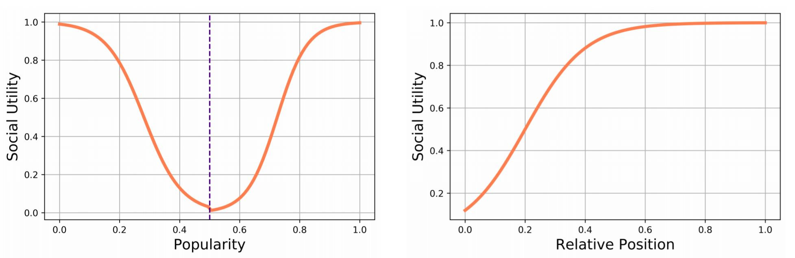
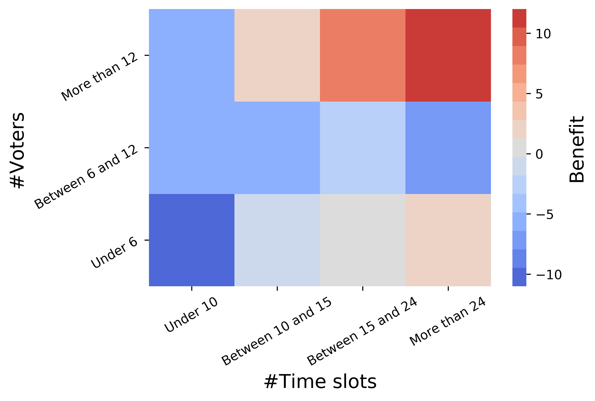
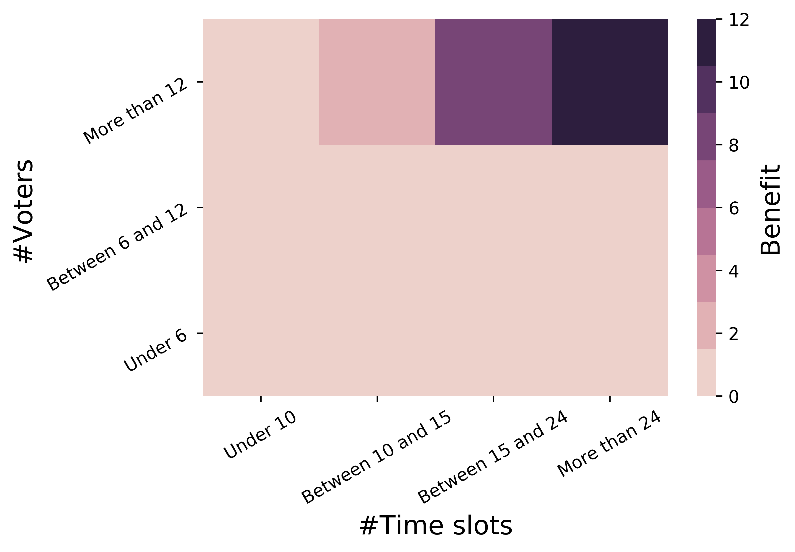

> The full notebook and code can be found [here](https://github.com/tom-beer/Strategic-Doodle-Sim) 

Did you know that Doodle polls are significantly affected by social bias? It turns out that open polls, where voters can see previous votes and their votes are visible to others, have different voting profiles compared to hidden polls. In a recent paper, [Zou et al. (2015)](#references) show that voters act stratigically in open polls, and this change in behaviour includes:
1. Open polls have higher response rates for very popular time slots
2. Open polls have higher response rates for very unpopular time slots
3. The average reported availability is higher in open polls compared to hidden polls

The first point not surprising - responders vote more for the popular time slots either because these alternatives are simply better for most voters, or because they feel the need to be cooperative with the group's choices.
The second point however does not make sense at first - why would a repsonder vote for a time slot that is clearly not going to be selected? The authors suggest that this is because voters in open polls have an incentive to appear more cooperative:
> "There is an implicit social expectation that every responder will mark as many slots as possible. Therefore a responder in open polls may be motivated to mark more slots. In other words, bearing in mind that other participants can see her name and vote, a participant may want to approve more time slots to appear more cooperative even if they are less convenient for herself."

The third point is likely a consequence of the first two points.

Here's an example of a typical Doodle poll. It is also available [here](https://doodle.com/poll/qx65aqr7ewmxrhrg).

  

## What's wrong with that?
One might think there's nothing wrong that voters in open polls behave differently than in hidden polls. But actually this can have a substantial negative impact on the quality of the selected time: [Alrawi et al. (2016)](#references) argue via a theoretical welfare analysis that when voters are being more generous with their time, this can lead to inferior time slots being selected.

## What can be done?
While we can't change human nature, we can come up with suggestions for models and algorithms that would cancel out the social bias. Since hidden polls have a higher chance of maximizing social utility, these algorithms should approximate what voting profile would have been recorded if the poll had been hidden.
In this short project, a collaboration with Bar Eini-Porat, we propose a simple solution to this problem. This notebook desribes the data and simulation we rely on, details the design considerations we faced, and shows the results of our suggested approach.

## Outline
The rest of this notebook is organized as follows.
First the dataset of Doodle polls is presented. Then the process of simulating synthetic open polls from real hidden polls is described, followed by detail about the debiasing model. The notebook concludes with results and a discussion on limitations and future directions.

### Dataset

The data used for this project is a small slice of the dataset that was introduced in [Reinecke et al. (2013)](#references). The original dataset, provided by Doodle, consisted of 1,771,430 anonymized date/time polls that were selected at random from a time period in mid-2011. Like [Zou et al. (2015)](#references), we focus our analysis on polls with at least three participants, at least four time slots and only yes/no options. Unlike [Zou et al. (2015)](#references), we analyze Doodle polls from all around the world, and use only hidden polls for our analysis. The obtained dataset consists of 104 polls and has a median of 9 responders and 10 time slots.

### Simulating open polls from hidden polls
The foundamental problem of causal inference is what makes the problem of evaluating a proposed solution so difficult. Meaning we never have access to the two parallel worlds of both an open poll and a hidden poll describing the same scheduling problem with the same group of people. Following [Alrawi et al. (2016)](#references), we treat the hidden polls of the dataset as ground truth: In a hidden poll each participant casts a vote based solely on their true availability, without introducing social considerations. This is the reason we chose to use only the hidden polls of the dataset. 

From each hidden poll we simulate an open poll using the following approach. 
We keep the number of participants and the number of time slots unchanged.
The first voter (usually the poll initiator) is not affected by social considerations, so her approved time slots are unaltered in the simulated open poll compared to the original hidden poll. 
As for the next responders, their approved time slots may change according to the poll's history up until their vote. 

In more detail, the simulation process consists of a three-step mechanism:
1. **Generate individual utilities**

    An individual utility $u_{ij}$ with $0 \leq u_{ij} \leq 1$ is assinged to each voter $v_i$ for each time slot $a_j$ indicating her valuation of attending the meeting or event during that time slot. These utilities are called 'individual' as they are not affected by other voters. We assume that there is a global, fixed 'yes-threshold' $\tau_1$ that represents the utility beyond which a voter “typically” votes yes, so each voter $v_i$ is expected to say yes to a time slot $a_j$ when her utility for that slot satisfies $u_{ij} \geq \tau_1$. Then, in order to comply with the hidden poll, we generate individual utilities greater then $\tau_1$ for the approved votes in the original hidden poll, and smaller then $\tau_1$ for the disapproved votes:

$$u^{ind}(a) \sim U[\tau_1,1] \text{ for } a \in A_1$$

$$u^{ind}(a) \sim U[0,\tau_1] \text{ for } a \notin A_1$$ 

   Where $A_1$ is the set of approved time slots for a voter in the original hidden poll.

2. **Generate social utilities**

    Like in the case of the individual utilities, social utilities are generated for each voter and time slot in each poll. The social utilities reflect the behavioral difference between hidden and open polls, i.e. they will be a function of the popularity of the time slot. Time slot popularity is defined as the ratio between approved votes to total number of votes.

    In addition, although it was not discussed in [Zou et al. (2015)](#references), we believe that the social utilities should also depend on the relative poll position, i.e. the fraction of the current voter to the total number of poll participants. For example, the second voter is less affected by social bias compared to the 10th voter. Since we do not have an accurate measure of the magnitude of the strategic behavior described in [Zou et al. (2015)](#references), we set this magnitude so that it will comply with the increase in average availability in open polls compared to hidden polls (from 0.53 to 0.39, see section 2.3 of [Zou et al. (2015)](#references)).

    Apart from the magnitude of the social effect, we also need to set a functional form for it. We propose a sigmoidal-shaped curve for the social utility as function of popularity. This is an asymmetrical gain-gain function that outputs an unpopularity-gain for values below some neutral popularity and a popularity gain for values above it. Similarly, we propose a sigmoidal-shaped curve for the social utility as function of relative position.
    
    The next figure illustrates these functions. The dashed vertical line denotes the neutral popularity, it need not be set at 0.5.

  

The social utility as function of both popularity and relative position is the product of the above two functions, scaled down by a factor representing the maximal possible social utility.

3. **Generate approved time slots**

Finally, an open poll is deterministically simulated from the hidden poll and generated utilities in accordance with the social voting model of [Zou et al. (2015)](#references):

$$\text{Approve  } \{ A_1^n,A_2^n \cap  Popular, A_2^n \cap  Unpopular \}$$

According to this model, there are three preference levels. A voter approves all of her most preferred slots, irrespective of their popularity. In addition, among the slots at her second preference level, the voter approves those slots that are either very popular or very unpopular. No slot of the third preference level is approved. $\tau_1$ is the decision boundry between $A_1$ and $A_2$, and $\tau_2$ is the decision boundry between $A_2$ and $A_3$.

Therefore, approved votes in the synthetic open poll will be those exceeding the individual threshold (those approved in the original hidden poll), or those that, together with the social utilities, exceed the threshold:
\begin{align*}
a: u^{ind}(a) > {\tau_1} \; \cup \; a: u^{ind}(a)+u^{soc}(a) > {\tau_{1}}
\end{align*}

An important note is that the magnitude of the social effect should not exceed the difference between the thresholds of the preference groups:
\begin{align*}
\text{Maximal Social Utility} \leq \tau_1+\tau_2
\end{align*}
    This assures that time slots in the least preferred level ($A_3$) will not be approved, regardless of the social effect.

### Debiasing the open polls
Now that we have simulated open polls, we can propose a method for circumventing the social effect. Our debiasing strategy is also a three-step process. First, we attempt to recover the social utilities that were in play for each voter and time slot. Then, we use these social utilities to weight the approved votes, with weight representing vote genuinity (a genuine vote is one that would have been approved irrespective of social considerations). Finally, we aggregate the weights to declare a winning time slot. 

In more detail:
1. **Estimate social utilities**
    
     In this step the social utility as function of popularity and relative position is estimated. We assume that both the functional form and social effect magnitude are known to us. This is a realistic scenario, as these quantities can be estimated efficiently from a large dataset.
     Computationally, this is equivalent to the first step of the simulation process. However, in the simulation process the utilities are calculated based on the ground-truth hidden poll, and here the social utilities are estimated based on the open poll history, which is itself biased from the ground-truth.
     
     
2. **Calculate weights**
    
    In this step, we weight the voters according to the probability that their votes are genuine. Our weighting mechanism is tightly related to the estimated social utilities. It is defined as follows, where $\hat{S_{ij}}$ are the estimated social utilities, $\alpha$ is a hyperparameter and $W_{ij}$ are the weights:
$$ W_{ij} = 1-\alpha \cdot \hat{S_{ij}} \text{ for } \alpha < 1 $$

3. **Declare winning time slot**
    
    The final step is to declare a winning time slot, aggregating information from the calculated weights. We want to minimize the risk that we falsely disapprove a vote that was actually approved in the hidden poll. We can fallback to the Doodle default algorithm (labelled DDA) and choose the most popular time slot whenever we are not confident with our approach. 
    
    We define the DDA score to be number of votes for each time slot. We define the debiased score to be the sum of weights for each time slot. The DDA winner and debiased winner are the maximal scoring time slot in each scoring regime.
    
    We choose to output a winner according to the reweighting mechanism only in cases with relatively high confidence: We recommend the highest scoring alternative in our model only in cases witg substantial score difference. Our final winning candidate for the open poll is defined as:
    
    $\text{if DDA score - debiased score} \geq \beta \cdot \text{debiased score:} $
    
    $\text{ final winner} = \text{DDA winner}$
    
    $\text{else final winner} = \text{debiased winner}$
   

### Results

The proposed method's performance is evaluated in the following manner. For each poll, there are four possible scenarios:
1. The winner in the original hidden poll matches both the winner proposed by DDA and the winner proposed by our method in the simulated open poll and.
2. The winner in the original hidden poll does not match neither the winner proposed by DDA nor the winner proposed by our method in the simulated open poll and.
3. The winner in the original hidden poll matches the winner proposed by DDA, but does not match the winner proposed by our method.
4. The winner in the original hidden poll does not match the winner proposed by DDA, but matches the winner proposed by our method.

We count the number of polls in each of the above cases. We define the method's benefit as the difference between the number of polls in case 4 and the number of polls in case 3. A positive benefit means that our method yields more good than harm.

Following is a summary of obtained benefits as function of the number of voters and the number of time slots. It is apparent that the proposed method yields positive outcomes only in cases with a relatively high number of voters and time slots.

  

If the method is restricted to these cases only, we obtain the following statistics:

  

Which means that it is possible to devise a new voting rule that has a strictly positive benefit.

### Discussion, limitations and future work
This notebook demonstrated a simple proof of concept to circumvent some of the adverse effects of the social voting phenomenon. Of course, further discussion about the work's limitations is warranted.

First, these results have limited statistical validity, as they are constrained by the small dataset available to us. Even though each hidden poll was used to construct many open polls, the effective sample size is still limited to the number of original hidden polls.
To alleviate this obstacle, we have also implemented a completely synthetic simulation that does not require real hidden polls. But since these simulated hidden polls are of questionable quality compared to the real world distribution, we found it hard to draw inferences based on them instead of the real data.

Second, the whole simulation and analysis environment lacks in external validity. The predictive ability of retrospective analyses is inherently problematic, and to make valid inferences, a true randomized controlled experiment would be required.

To conclude, while further investigation is recommended, this work demonstrated the potential for a simple voting rule to increase overall social welfare.

## References
Alrawi, D., Anthony, B. M., and Chung, C. (2016). **How well do doodle polls do?** In Lecture Notes in Computer
Science (including subseries Lecture Notes in Artificial Intelligence and Lecture Notes in Bioinformatics), volume
10046 LNCS, pages 3–23. Springer Verlag.

Reinecke, K., Nguyen, M. K., Bernstein, A., Naf, M., and Gajos, K. Z. (2013). **Doodle around the world:
Online scheduling behavior reflects cultural differences in time perception and group decision-making.** In
Proceedings of the ACM Conference on Computer Supported Cooperative Work, CSCW, pages 45–54.

Zou, J., Meir, R., and Parkes, D. C. (2015). **Strategic voting behavior in doodle polls.** In CSCW 2015 - Proceedings
of the 2015 ACM International Conference on Computer-Supported Cooperative Work and Social Computing, pages
464–472. Association for Computing Machinery, Inc.
