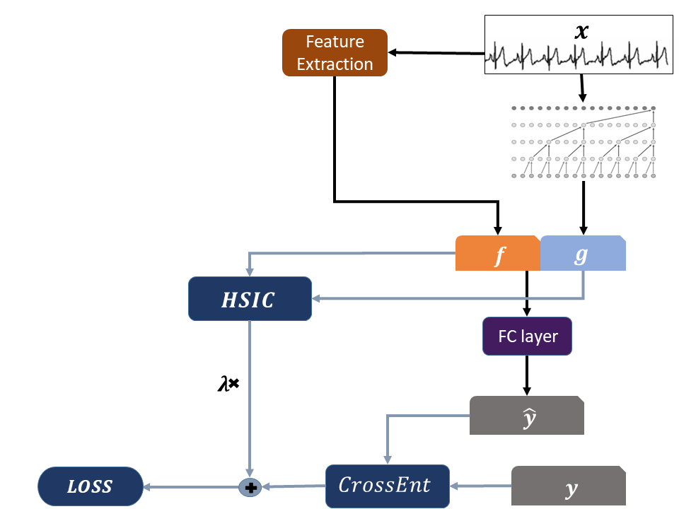
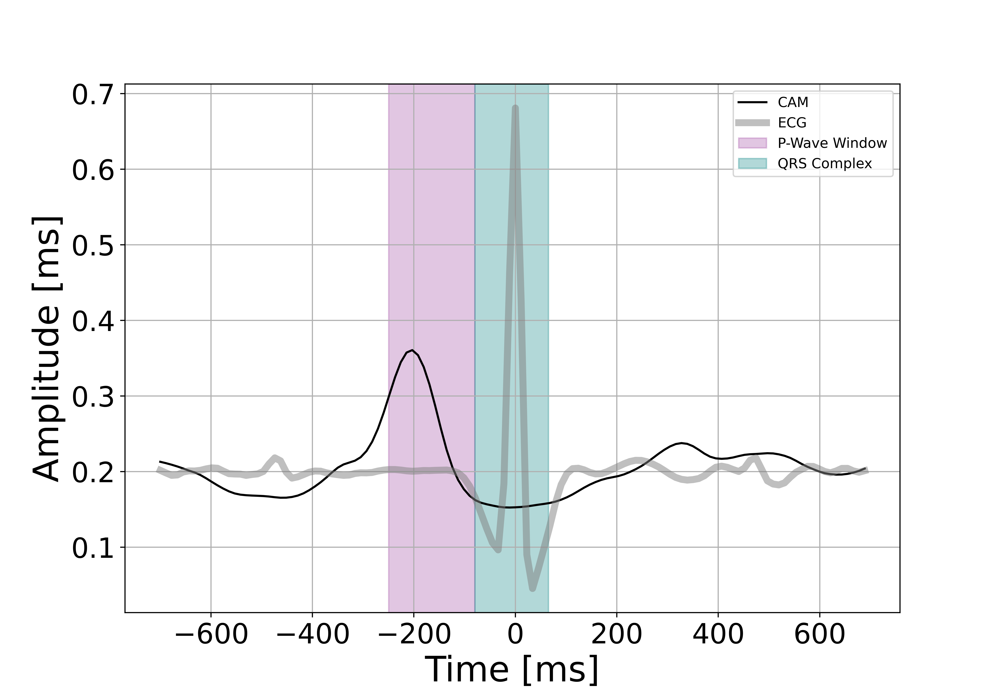
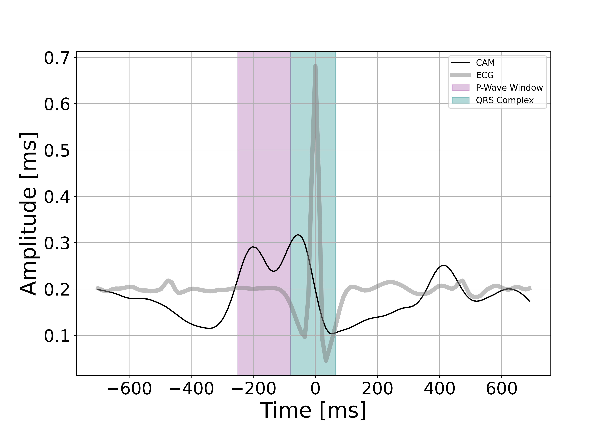

This post will summarize the main points in our recent work - [Using Deep Networks for Scientific Discovery in Physiological Signals](https://www.mlforhc.org/accepted-papers), which will be presented at the 2020 Machine Learning for Healthcare Conference. 

---
## Motivation

Despite the tremendous breakthroughs that deep learning models have brought in the last decade, they remain largely undeployed in high stakes domains like healthcare. Clinicians do not trust the outputs of complex black box models, and prefer to work with simple, interpretable systems that base their decisions on theoretically grounded and understood features. 

For example, in the case of cardiac abnormality detection from ECG signals, practitioners are likely to trust a simple decision tree that uses features they understand like variance of the heartbeat interval series, energy content in different parts of the signal etc.; They likely won't trust a classifier that bases its decisions on deep representations. See this very good survey on [what clinicians want](https://arxiv.org/pdf/1905.05134.pdf).

But it's exactly the super efficient representation extraction capabilities that make deep learning models so special. End to end models trained in hours exceed or compare to performance of systems that are based on decades-long research and engineering of useful features. In uncharted areas (for example if a new sensing modality would be invented), deep learning models would prove useful from day zero.

**What if we could extract interpretable, clinically sound features from the neural network's latent representation, to be used in simple machine learning models? Then these models would be easily deployed in healthcare and other high stakes domains. This is the main motivation for our work.**

---
## Main idea
To do that, we need two things:
1. A way to understand which aspect of the signal the latent representation captures and focuses on. We use [class activations maps](http://cnnlocalization.csail.mit.edu/Zhou_Learning_Deep_Features_CVPR_2016_paper.pdf) (CAMs) for this aim.
2. A way to make the network *remove* a feature from the latent representation's hypothesis space. We solve this by modifying the network's architechture and loss function: concatenating the external feature to the latent representation layer, and imposing statistical independence between the two.

The reason we need a mechanism to *unlearn* a predefined feature from the network's representation is that we imagine an iterative discovery process. At first, no domain knowledge is available, and so we can learn the task without constraints, using some visualization scheme (like CAMs) to derive a first set of useful, interpretable features. Next, we would like to extract only the residual information - what is not encoded in the first set of features. To do this we need a notion of independence, or orthogonality, between two representations. Only when the network's representation is independent from the already known features could we hope to discover a new feature set. This process goes on and on, until no more information is extracted from the network.

---
## Method
Achieving this goal can be broken down into 3 steps: Building the constrained representation, ensuring its validity (that it's indeed independent, for example) and visualizing the activations to extract features.

### Construction of the constrained representation
We assume we have access to a set of $n$ samples of the form $(x_1,f_1,y_1), ... , (x_n,f_n,y_n)$, where: $x_i$ are raw signals, for example ECG signals; the vectors $f_i$ are hand-engineered features, calculated as a deterministic function of $x_i$, and typically of much lower dimension than $x_i$; and, $y_i \in [1,\ldots,k]$ are discrete labels.

The main goal of the architecture and loss function proposed below are to learn DNN features (denoted $g_i$) which are on the one hand informative about the labels $y_i$, but on the other hand contain as little information as possible about the hand engineered features $f_i$. This is achieved by combining two elements: a term added to the objective function which encourages statistical independence between the $f_i$ and $g_i$, and an architecture which encourages $g_i$ to be non-redundant with respect to $f_i$. 

**Independence measure**

The measure chosen to enforce independence between the hand-engineered features $f_i$ and the DNN's representation $g_i$ is the Hilbert-Schmidt Independence Criterion (HSIC), which is based on the eigenspectrum of covariance operators  in  reproducing  kernel  Hilbert  spaces.

There are various other measures of statistical independence; the advantage of HSIC is that it is non-parametric, unlike mutual information, and so it is fit for samples not following a prescribed distributional form. In addition, it does not require training an additional model (i.e. an inference network for variational approximation or an adversarial network).
 
HSIC can be thought of as a non-linear extension of the cross-covariance between two random variables. Unlike the cross-covariance, the HSIC between two random variables $X$ and $Y$ equals $0$ if *and only if* $X$ is independent of $Y$ (under certain regularity conditions).

  
<b>More on HSIC</b>

        This HSIC loss is calculated in the following manner. For $\mathcal{F, G}$ RKHSs with universal kernels $k$, $l$ we compute the kernel matrices $K_{ij} = k(f_i,f_j)$ and $L_{ij} = l(g_i,g_j)$. Both $k$ and $l$ were selected to be Gaussian kernels:
        $$ K_{i,j} = e^{\frac{{|| f_i-f_j ||}^2_2}{\sigma^2}} $$
        With $L_{i,j}$ computed in a similar manner. Then the scaled Hilbert-Schmidt norm of their cross covariance matrix is calculated:
        $$
        \widehat{HSIC}(\{(f_i,g_j\}^n_{i=1}; \mathcal{F, G} ) = \frac{1}{(n-1)^2}  \cdot \textbf{tr}(KHLH)
        $$
        where $H_{ij}=\delta_{i,j}-\frac{1}{n}$ is a centering matrix.

 

**Setting the bandwidth $\sigma$**

For each kernel matrix, the bandwidth $\sigma$ is set to be the median pairwise distance of the data points, a heuristic described [here](http://is.tuebingen.mpg.de/fileadmin/user_upload/files/publications/ICML2009-Mooij_[0].pdf). Since $f$ is a fixed representation space, its median pairwise distance can be computed once before training. However $g$ changes every training step, so its bandwidth is updated accordingly at every training step based on a moving average between the current median pairwise distance and the previously set bandwidth.

**Concatentation**

The hand-engineered features $f$ are usually highly predictive for the selected task. In order to further encourage the DNN latent representation $g$ to be distinct from $f$, the two representations are concatenated before passing them on to the final layer of the network. This is done to prevent, as much as possible, from the network representation $g$ to try and replicate $f$, even when under the HSIC constraint. We have found that it is not possible to achieve both reasonable classification accuracy on the original task and sufficient independence from the external representation without this concatenation step.

**Loss function**

The loss function of the network's output is given by:
$$
    \lambda \text{HSIC}\left([f_1,\ldots f_n];[g_1,\ldots,g_n]\right) + \sum_{i=1}^n \text{CrossEntropy}\left(\hat{y}_i,y_i\right),
$$
where $\lambda$ is a hyperparameter controlling the degree of independence induced between the DNN representation $g_i$ and the hand-engineered representations $f_i$. This parameter is tuned to ensure both high performance on the original task and sufficient independence relative to the external features.

**Schematic view**

If that sounded complicated, maybe a diagram would clear things up:

This concludes what we refer to as the *main task*.

### Validation of the representation

So, we trained a neural network and validated that it yields a reasonable classification accuracy, but what guarantees do we have that (1) the network has succeeded in achieving true independence between the hand-engineered features and internal network representation while (2) retaining some information about the label within the DNN representation? We define two auxiliary tasks whose aim is to boost our confidence in the claims made in the main task

**Independence**

The HSIC term in our loss function is meant to induce statistical independence between the hand-engineered features $f$ and the DNN features $g$. We validate that this is indeed achieved by checking whether one can predict the features $f$ when given the features $g$ as input. We do this by training a multi-task DNN whose input is $g$ and output labels are the entries of $f$. We then measure the held-out squared correlation $R^2$, averaged across the dimensions of $f$. An average $R^2$ value close to 0 indicates a high degree of independence. As a further reference point, this value is compared to the $R^2$ value obtained using an network with the same architecture as ours but without the HSIC term (equivalent to setting $\lambda$ = 0), which we call the *baseline model*

**Residual Information**

To confirm that the obtained representation $g$ holds useful information for the task in question, we run the following evaluation: Our method is trained on a sample set $train_1$ . Then we apply the representation function $g$ to a separate sample set $train_2$. We fit a vanilla 3-layer network, which we call *Rep2Label*, predicting $y$ from $g$ on the training set $train_2$. Finally, we evaluate the accuracy of *Rep2Label* on a held-out test set. An accuracy greater then chance indicates that the latent representation still holds valuable information about the label and can be analyzed for our goal of scientific discovery. 

### Feature discovery through visualization
The third and final step in the proposed framework is to visualize the network's activations over different aspects of the input signals using CAMs. CAMs are a technique for visualizing spatially localized class-relevant information. They are obtained by a simple matrix multiplication between a CNN’s activations (before global average pooling) and the weights of the fully connected layer.

For a physiological signal the output of CAM is, for each sample, a time series showing what parts of the signal produce strong activations per a given class. We (1) align these activation profiles around a meaningful physiological landmark, e.g. an R-peak in ECG signals or a rapid eye movement in EEG signals, (2) normalize the  activation profiles to [0, 1], and (3) average them over the entire test set. When the mere existence of an event is significant, we would expect CAM peak over the event start. This high activation over the event’s start is interpreted as importance for the task.

---
## Some results
This approach is demonstrated for two types of signals and tasks: Atrial fibrillation detection in ECG signals and REM detection in EEG signals. Both these tasks were very well studied in the medical literature over the last decades, so we do not aim to discover anything new here. Instead, we aim to discover the already known domain knowledge. Because *discovery* is a qualitative notion and we do not have any quantitative measures of success, it was important to select example tasks that could serve as benchmarks for our approach. 

The full results are in the paper, including details about the experimental setup. Here I will focus on one type of result from the ECG use case. 
**Data and task**

The dataset used for this experiment is from the [2017 PhysioNet Challenge](https://physionet.org/content/challenge-2017/1.0.0/).

The original challenge's task was to classify single-lead ECGs to the following categories: Normal, atrial fibrillation (AF), other and noisy. We modified the task to be a binary classification: detection of AF.

**External features**

When clinicians diagnose AF from ECGs, they focus on 2 types of signal properties:
1. Properties of the RR interval sequence. In cases of AF, the heartbeats are irregularly spaced. Hand-engineered features that capture this behavior include median, STD, RMS, multiscale entropy, minimum and maximum of the RR sequence.
2. Properties of the P-waves. P-waves are the first positive deflection in a normal heartbeat. In AF, the P-wave may not exist at each beat. Hand-engineered features that characterize this part of the signal include the maximum, STD and energy of the amplitude of the time windows where the P-Wave should appear.

The model was trained 4 times: With no features (baseline), with the RR features, with the P-wave features and with all features together. After ensuring that the models have passed the validation tests, the following mean activations were extracted.

**RR constrained model:**

**P-wave constrained model:**

For the RR model (whose representation is encouraged not to use R-peak related information), we observe an almost smooth  activation with a clear peak which starts around 300ms before the R-peak and ends around 100ms before the R-peak. That is, The RR model’s activation peak has an almost perfect overlap with the expected location of the P-wave window. In addition, in the P-Wave model’s activation (i.e a model that is pushed to not use P-wave-based features), it seems that the activation shifted toward the R-peak starting point. As one of the hallmark features of AF is the loss of regularity of the intervals between consecutive R-peaks, an increase in activation at the expected location of the R-peak seems to reflect the shift of the internal  representation.

---
## Discussion
This work shows a proof of concept for the discovery of interpretable features by imposing constraints on neural representations.
There are some limitations, including:
1. The proposed framework is relevant mostly to local, morphological features due to the nature of the class activation maps.
2. The real challenge of feature discovery is not nearly solved by this approach. A domain expert needs to translate the activation templates and come up with interpretable functions or scientific understanding that capture the exposed pattern.