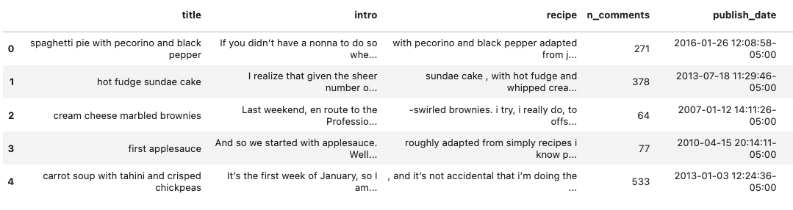
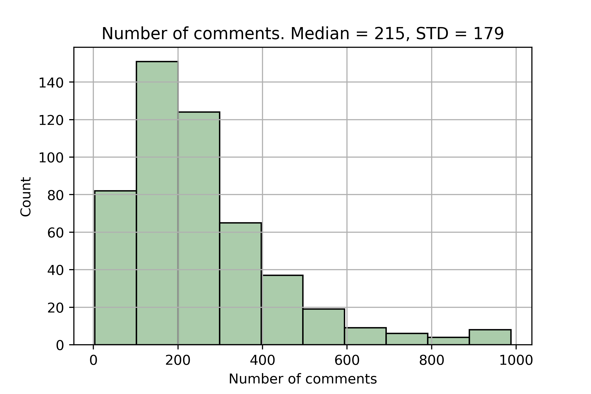
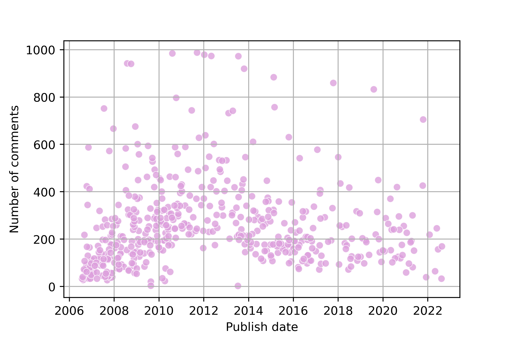
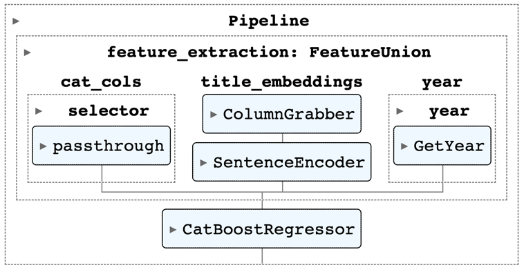
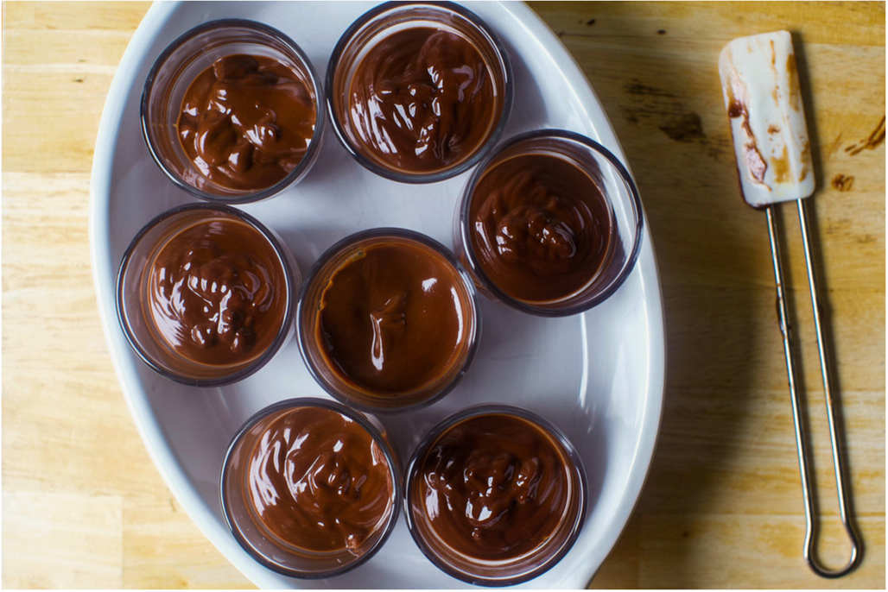

### My favorite food blog
I'm an avid reader of a multitude of food blogs. 
While I wish I read books, I just can't prioritize it high enough, and apart from professional material, the only reading I do is food blogs.
I love [David Lebovitz](https://www.davidlebovitz.com/) for the french drinks and apéros, and [Green Kitchen Stories](https://greenkitchenstories.com/) for healthy, kid friendly (Yaar loves [these muffins](https://greenkitchenstories.com/apple-almond-buckwheat-muffins/)) recipes.
In Hebrew, I check [Ptitim](https://www.ptitim.com/), [Limor Tiroche](https://www.limortiroche.com/) and [Michal Waxman](https://www.michalwaxman.com/) on a weekly basis and read every word in every post.

But above all these, my favorite food blog is [Smitten Kitchen](https://smittenkitchen.com/). 
My metric here (we're in a quantitative field after all) is the total number of recipes made. 
This proxy may be skewed by ultra-recurrent recipes 
(like the [oatmeal pancakes](https://smittenkitchen.com/2010/05/oatmeal-pancakes/) I make every Saturday morning for the last ~18 months), 
but it's still a useful metric.

Having wanted to play around with web scraping and parsing,
I thought it would be a fun weekend project to build a popularity prediction model for Smitten Kitchen recipes.  


[//]: # (Other recurrent recipes are the corn and butter farro, which is)

---
### Dataset

Beautiful Soup helped with basic parsing, 
on top of which specific features like the publish date, categories, post title, introduction and the recipe itself were extracted.
The number of comments was defined as the measure of recipe popularity (more on this decision in the last section).  
The resulting dataset (not showing the category column) has 505 recipes and looks like this:


As can be expected, the number of comments is heavy tailed. 
But this tail is rather fat - the standard deviation is almost as large as the median: 


[//]: # ( eda as we go)

---
### Setting the baseline
RMSE on the test set (~100 recipes) was chosen as the evaluation criteria for all models.

A useful baseline for regression tasks is simply to predict the target's mean.
This yields an RMSE of **202**, a bit higher than the target's STD (due to train/test sample variability).

It couldn't be hard to beat this error, right? Let's see..


---
### Recipe Categories
Each recipe has a few categories (tags) - an average of 5 per blog entry. 
The most prevalent are *vegetarian, summer, breakfast, cake, salad* and *weeknight favorite*. 
The 184 categories were encoded as bits and passed to a CatBoost model with default parameters.
The RMSE decreased to **194** - quite underwhelming.

---
### The Direction of Time

Time is a significant predictor of popularity, especially in the early days of the site.



Using the annual means from the train set as an estimator for recipe popularity yields an
RMSE of **181** - now we're getting somewhere! 

---
### Incorporating free text

The dataset includes three fields of free text: post title, an introduction and the recipe itself.

[Sentence Transformers](https://www.sbert.net/) provides a convenient API for encoding chunks of text, 
but they don't play nicely with scikit-learn pipelines. Recently I came across a compact library called 
[_Embetter_](https://github.com/koaning/embetter) which does just that - a scikit-learn compatible interface 
for sentence transformers. 
It also has an interface over [timm](https://github.com/rwightman/pytorch-image-models) for image use cases. 
With Embetter, predicting a target from text is as easy as:
```python
pipe = make_pipeline(ColumnGrabber("title"), SentenceEncoder('all-MiniLM-L6-v2'), RandomForestRegressor())
pipe.fit(df_train, df_train.n_comments)
mean_squared_error(df_val.n_comments, pipe.predict(df_val), squared=False)
```

After some experiments, I settled on the following pipeline:



Embedding the other text fields did not add predictive power. 
Applying PCA and using other regressors just made things worse.
The RMSE for this setup was **174** - only slightly better than using the year alone. Meh.

---
### Closing thoughts

While this was a lot of fun, I can't help but feel a bit disappointed in failing to predict recipe popularity.
The thing is, I equated popularity with the number of comments. 
But it's a mere proxy for popularity. And as we've seen in a 
[previous post](https://tom-beer.github.io/post/proxies_ml/), 
this has implications for the feasibility and usability of the models built upon it. 


---
### Takeaways

[This is a fabulous dessert](https://smittenkitchen.com/2019/06/chocolate-budino/). Go make it.


