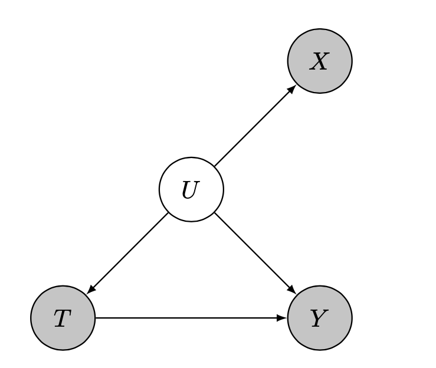

This is part one (of at least two) posts about the hazards of using proxy variables in statistical/ML models. Proxy variables are pervasive in almost every data-driven analysis. Part one will focus on the case of observational causal inference, where the main harm is severe bias of the treatment effect estimates.

---

## Confounding

Confounding is one of the fundamental challenge to identifying and estimating causal effects. It is a fundamental challenge because the condition of unconfoundedness (sometimes termed ignorability), which is a prerequisite for causal inference, is unverifiable from the data alone. Meaning the observed distribution can be explained by many different data generating processes (DGPs). For a simple illustration, consider the following two DGPs (created by David Lopez Paz):

```python
x = np.randn(N)
y = 0.701 * (x + np.randn(N))
```
```python
z = 0.8410 * np.randn(N)
x = z + 0.5412 * np.randn(N)
y = z + 0.5412 * np.randn(N)
```
In both cases, the observed distribution $P(X,Y)$ is identical. Yet in the second case, without measuring $z$ and accounting for it, we might be misled to think that $x$ and $y$ have a causal effect on one another. The challenge is that we would never be able to know for sure that all confounders were measured and collected. This challenge leads many practitioners to collect and account for as many variables as they possible can - a *'throw in the kitchen sink'* approach.

---

## Proxies of confounders

That's good in theory. But in most real-world observational studies, true ignorability of the treatment assignment doesn’t hold, because we can’t accurately measure all possible confounders. Let's say we want to measure socioeconomic status (SES) because it potentially confounds the effect of red wine intake on the risk for CVD. But what is SES anyway? It’s an abstract concept, never to be measured directly. Same goes for intelligence, or health.

Luckily we may have access to proxies for these constructs. E.g. ZIP code, years of education or income for SES, IQ test score for intelligence and BMI, blood tests for health status etc. Proxies are everywhere! It can even be argued that all variables are proxies for the latent constructs we would have wanted to measure.

---

## Using proxy variables

How should one use a proxy variable  in a causal analysis? Should we control (adjust) for them, or not? Technically they’re not confounders, because they don’t lie on a backdoor path between treatment and outcome. The following is a graphical representation for a proxy of a confounder.



On the other hand, these proxies are associated with the unmeasured confounders, and so may indirectly adjust for some of the confounding bias. The widespread common practice, whether intentionally acknowledging the covariates as proxies or not, is to use them just like true confounders. For example, a [recent textbook](https://www.hsph.harvard.edu/miguel-hernan/causal-inference-book/) (highly recommended!) states that it is typically preferable to adjust, rather than not to adjust, for confounder proxies.

---

## Residual confounding


What are the implications for this analysis choice? Confounding bias **will not be eliminated**, no matter how many proxies we gather and irrespective of sample size! To demonstrate this phenomenon of residual confounding, consider the above DAG with $X = U + noise$ for increasing noise intensity. The following is an illustration of the observed data, and the title contains the noise intensity and estimated average treatment effect (ATE).


 
The true causal effect is constant and equals to 1. The confounding is significant: without considering $X$, the average associational difference between treatment groups is about 2.4. When $X$ is accurately measured (setting $\sigma=0$), the causal effect is consistently estimated from data (up to finite sample errors; low sample size was chosen for visibility). But with measurement error, the ATE estimate is biased. The corruption mechanism is the infamous attenuation bias. Unlike simple attenuation bias which always shrinks the regression coefficient towards zero, the bias in ATE estimation can go either way, depending on the data generating process.


<details>
  <summary><b>More details for the above simulation</b></summary>

Consider the following DGP: a one-dimensional latent (unobserved) confounder $U$ generates noisy measurements $X$. The treatment $T$ is assigned according to the latent confounder and the outcome $Y$ is a function of the treatment and the latent confounder. The specific dependency structure of this DGP is given below.
 
\begin{align*}
U \sim \mathcal{N}(0,1) 
\end{align*}
\begin{align*}
X \mid U \sim \mathcal{N}(U,\sigma)
\end{align*}
\begin{align*}
T \mid U \sim \text{Bernoulli}(\text{Sigmoid}(2.5 \cdot U))
\end{align*}
\begin{align*}
Y \mid U,T \sim \mathcal{N}(U+T,1)
\end{align*}

</details>
</br>

In the limit of infinite variance for the measured covariates' noise, the estimated causal effect would converge to the associative difference between treatment groups, as the covariates would lose all information they hold.

---

## Prevalence and mitigation

To what extent does this issue impact empirical causal inference analyses -- what is its prevalence and magnitude? It is hard to know. A few studies tried to shed light on this by measuring potential confounders *and* proxies for these variables, like in [this work](https://link.springer.com/article/10.2307/2648118). Other studies managed to show that attenuation bias did indeed occur, like in [this work](https://bpspsychub.onlinelibrary.wiley.com/doi/abs/10.1111/bmsp.12146?casa_token=d0jDi0c8ROAAAAAA%3AyM6kJWHzFZSX8guP7ayeWKnWwqDz5Mv5SAiTw0bZrKfcnMIWD-R0XE-piFFzlXouuzCA7r0watzzrg).


Some works have attempted to find solutions for this obstacle, dating back to the [beginning of the previous century](https://www.jstor.org/stable/1422689), but this has proved to be a challenging task. Suggested methods either require stringent assumptions or offer no guarantees on the quality of the solution. Notable examples are works using [matrix factorization](https://papers.nips.cc/paper/2018/file/86a1793f65aeef4aeef4b479fc9b2bca-Paper.pdf) and [deep learning](https://proceedings.neurips.cc/paper/2017/file/94b5bde6de888ddf9cde6748ad2523d1-Paper.pdf). 


---

## Summary and implications

Residual confounding bias due to the use of proxy variables is a significant obstacle in non-experimental causal inference. Its implications are potentially severe, as the bias could vary in sign and magnitude, making causal effect estimates unreliable. Due to both the limitations of the proposed solutions and an inadequate awareness of the harms described here, the present state of empirical practice is unsatisfactory - none of the proposed methods have gained adoption by practitioners, who continue to produce error-prone analyses.
