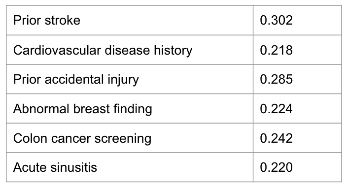
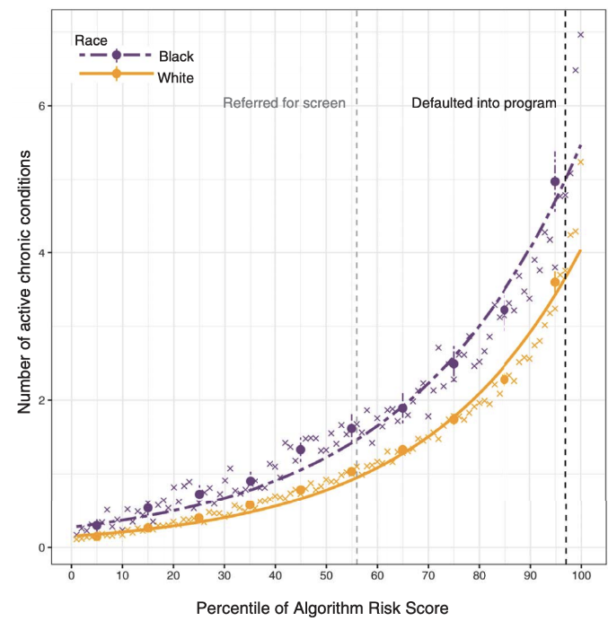
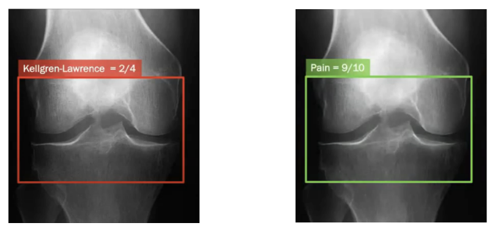

After reviewing the implications of using proxy variables in the context of causal inference, 
this post will provide a similar review for the context of prediction models. 
This post uses three short stories that demonstrate the problem, with a discussion following.

---

## A Riddle

Let's start with a riddle, presented in [MO (2017)](https://scholar.harvard.edu/files/sendhil/files/aer.p20171084.pdf).  It goes like this:

You are given a risk score model for stroke prior to it being deployed in a hospital's ER for the purpose of triaging patients. 
This is an important task as symptoms might be subtle for life-threatening conditions like stroke.   

The training data consists of ~200K visits to the ER of the said hospital. The predictors used are demographic 
data and also any prior diagnoses present in the EHR system over the year before
the ER visit. The label is a diagnosis of stroke in the week of the ER visit, and the task is modelled using logistic regression.

The reported PPV and other metrics seem great, but being a good data scientist you decide to look at the top predictors for future stroke.
Since this is a linear model without interaction terms, the top coefficients might be sufficient for gaining some insight into the model.
You see the following:

Prior stroke – that’s expected. CVD history – makes sense. But accidental injury? Colonoscopy? Sinusitis? How can these increase the likelihood of stroke? What’s happening here? 
Did the model uncover new risk factors for stroke, unknown to the medical literature?

---

## The Answer

To figure this out, it’s useful to understand what we are actually predicting here, because it surely isn’t just stroke. 
We are not predicting biological stroke, but the presence of a billing code or a doctor's note indicating stroke. 
There is a vast difference between the two. For a stroke to be recorded in the data, a patient has to have stroke-like symptoms, decide to seek medical care, get tested and diagnosed with stroke. 
Meaning the model predicts a patient’s **propensity to seek care** just as much as it predicts stroke. In other words, stroke measured in the data is the combination of real biological stroke with **heavy utilization** of the medical system. 
Would we want this model deployed? Of course not.

---
## Story 2: chronic conditions
The stroke model was trained (from real data) to prove a point, but it was not intended to be deployed at any time.
The second story is about a model that was actually used to generate predictions at a massive scale - for about 70 million Americans each year.
Chronically ill patients receive poor healthcare, so algorithms are used extensively in attempt to target patients into ‘high risk management' programs. 
The motivation is to anticipate which patients are at risk for hospitalization, disease flare up, mortality etc., and then intervene to prevent these. 
Unfortunately, this algorithm was racially biased (this was subsequently fixed with the help of the researchers that uncovered the bias).

The decision process goes like this. The model generates a risk score, and then the top 2% of risk scores are enrolled to the high risk program.
The bias can be seen as easily as plotting the risk score percentile against the comorbidity score (stratified by race).

We see that or each predicted risk score percentile, Blacks have more active chronic illnesses. 
How did this bias come about? The model attempted to predict healthcare needs, and used medical expenditure as the prediction target.
But Blacks and Whites have different relations between health status and cost (due to many reasons).
In short, Black patients cost less conditional on health. Equating expenditure and healthcare needs 
generated this disparity. This story was uncovered by [OPV (2019)](https://www.nature.com/articles/s41591-020-01192-7).

---

## Story 3: Knee Pain

Pain in general is concentrated in society’s most disadvantaged. For example, Blacks report pain twice as frequent compared to other ethnicities. 
Knee pain is one condition where these disparities are present. 
The routine treatment protocol for knee pain is to have an X-ray evaluated by a radiologist. 
Osteoarthritis severity is measured from the X-ray based on standard scores like the Kellgren–Lawrence grade.
Then the patient is commonly referred to either knee replacement surgery or physiotherapy.  

Unfortunately, it has been shown many times that pain disparities remain even when adjusting for
radiographic osteoarthritis severity (KLG) - 
Black, lower income and lower education patients have more pain at every level of X-ray graded disease severity. 

This doesn't make sense. Why are radiologists not able to see pain the same for all people? 
Because radiographic severity is not a credible predictor for pain. This might have to do with the fact that
KLG was developed in the 50s on White British males, while being applied today on the whole population, 
as discussed in [PCL+ (2021)](https://www.nature.com/articles/s41591-020-01192-7).

---

## Tying it up

The recurring theme in all three failure cases is unintended implications of using proxy variables in predictive modelling. In the first case, stroke recorded in the ER data was a proxy for stroke in the general population. 
In the second case, medical expenditure was a proxy for healthcare needs. And in the third, the radiologist’s diagnostic label was a proxy for the true underlying pain. 

If we think about it, these examples are not exceptions. In most predictive tasks, we are interested in modelling unobservable theoretical constructs, like socioeconomic status, patient health, teacher effectiveness etc. 
Because these constructs cannot be observed, they cannot be measured directly. Instead, they must be inferred from measurements of observable properties. Collapsing the distinction between unobservable constructs and observed data might cause adverse implications, 
while acknowledging this gap is the best thing we can do to anticipate (and maybe mitigate) these implications. 

---

## Further reading

The theory of measurement modelling formalizes a statistical model between the latent construct and its measured proxies.
[This work](https://arxiv.org/abs/1912.05511) is a great read on the topic. 

Aside from fairness related harms like discussed here, when using proxies we can expect a mismatch between the predictive task and the real world objective. 
This might also lead to misleading evaluation of the model -see this [great talk](https://slideslive.com/38938219/evaluating-ml-decision-support-tools-as-embedded-systems).

Ever seen claims of superhuman medical performance? It is likely because the model performs a proxy for the real medical task, see for example the discussion [here](https://t.co/tpsZufYZ7G).

---

## Takeaway

Proxy variables and proxy tasks have broad implications for the utility and fairness of the models in which they are used. 
By making explicit the gap between the objective and its proxy, we might be able to build better ML systems. 

