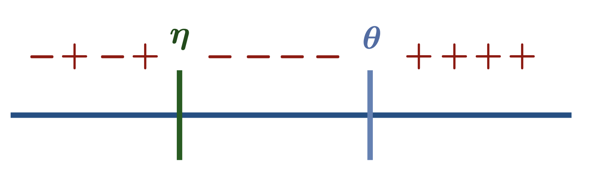
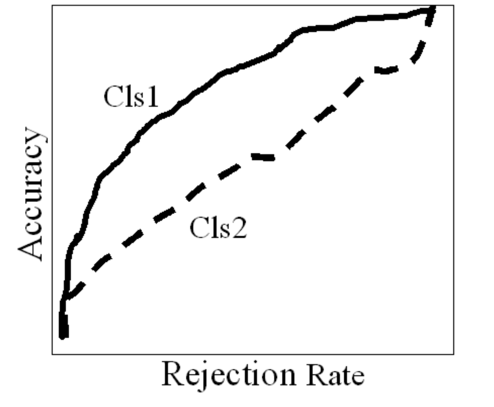

This post introduces the framework of rejection learning with applications to algorithmic automation problems.

## Responsible Prediction

In high stakes domains like healthcare, machine learning systems must exhibit some sort of accountability and sensibility for them to be safely deployed. While it is still a difficult and ill-defined task, there are many approaches to making prediction models behave responsibly. For example, we can manipulate the raw model outputs, to make sure that it alligns with a predefined set of rules. Another example is to defer the decision to a simpler model, like a medical protocol. 

Using a rejection mechanism is one aspect often neglected in the design of prediction models. When a model has the ability to [abstain](https://www.nature.com/articles/s41746-020-00367-3) from making a prediction, the resulting system is expected to be a lot more sensible. In healthcare, this would mean models that are safer, better performing, and trusted by  physicians.

---

## Automation $\neq$ Prediction

The main motivation for rejection learning is algorithmic automation. Many actionable prediction tasks are actually automation problems – we want to replace human effort with algorithms. 

We tend to equate prediction and automation, but by doing that we miss out on challenges and opportunities that arise from the differences between the two problems: 

Since automation builds upon the stable ground of humans performing a task, in most applications there's no requirement that all instances be automated by the algorithm. Unlike prediction problems that do not build upon humans performing a task, here applying automation to any fraction of the population has a significant potential for impact. Thus algorithmic automation is more than just the replacement of human effort - it also includes the meta decision of which instances to automate. A great overview of this topic is available [here](https://arxiv.org/abs/1903.12220).

---

## Classification with Rejection

In rejection learning, we extend the multiclass output space $\mathcal{Y}= \\{ 1,\ldots,K\\}$ to include $\circledR$ which denotes rejection. In ordinary classification we use the usual zero-one loss $\ell_{01}(f(\boldsymbol{x}), y)=\mathbb{1}_{[f(\boldsymbol{x}) \neq y]}$, and in rejection learning we use an extension of it -- the zero-one-c loss:

$$
\ell_{01c}(f(\boldsymbol{x}), y) = \begin{cases}
    c & f(\boldsymbol{x}) = \circledR \\ \newline
    \ell_{01}(f(\boldsymbol{x}), y) & \text{otherwise}
\end{cases}
$$

This loss funcion means that we pay a cost of $c$ if we choose to reject the instance, and otherwise pay a cost of $1$ for a missclassification.

---

## Optimal Classifier
The optimal solution for a function minimizing the expected risk w.r.t $\ell_{01c}$ was formulated backn in the 1950s by [Chow](https://ieeexplore.ieee.org/document/5222035):
$$
f^*(x) = \begin{cases}
    \circledR & \text{max}_y \text{ }P(y|x) \le 1-c \\ \newline
    \text{argmax}_y \text{ }P(y|x) & \text{otherwise}
\end{cases}
$$

This classification rule dicatates that we should reject an instance if the posterior probabilities for all $K$ classes are smaller than $1-c$.

---

## Determining the rejection cost $c$

The cost of rejection is a hyperparameter we need to set before learning a classification rule. A larger cost means that more instances are rejected, so it should be set by considering a tradeoff between the coverage rate (the fraction of accepted cases) and cost of missclassification. 

A discussion on this tradeoff follows towards the end of the post, but a rule of thumb applicable for any task is this: $c$ should be smaller than the cost induced by a random guess (otherwise we would obtain an unhelpful, trivial classifier). Assuming the classes are balanced, this rule of thumb implies that: 

$$
c \in \bigg(0, \frac{K-1}{K}\bigg), 
$$

and in the general case of imbalanced data, $c$ should be smaller than one minus the smallest class size.

---

## Two approaches

How can we learn a classification with rejection rule? The literature describes two possible approaches. 

First is the **confidence approach**. Chow’s optimal rule suggests that classification with rejection is solved if we know the posterior distributions of the classes given the data. Hence the confidence approach is a straightforward solution: train a classifier and use the output of the classifier as a confidence score, drawing inferences by substituting the confidence scores in Chow's rule. The main drawback here is that reliabely estimating class-posterior probabilities is difficult (to say the least). For example, neural networks are notoriously known for their overconfident scores.

Second is the **classifier-rejector** approach. If we take another look at Chow's rule, we can rewrite it as two functions:

$$
r^*(x) = \text{max}_y \text{ }P(y|x) - (1-c)
$$

$$
h^*(x) = \text{argmax}_y \text{ }P(y|x)
$$

where $h(x)$ is an ordinary classifier and $r(x)$ is a rejector, rejecting instances if it's value is negative. This formulation suggests that a classification rule could be obtained by learning two independent functions. Apart from a neat logical separation, this approach is more flexible compared to the confidence approach. For example, different hypotheses spaces could be used to model the classifier and rejector. A simple illustration for the increased flexibility of the classifier-rejector approach was brought in [this paper](https://cs.nyu.edu/~mohri/pub/rej.pdf) -- for the case of linear models, only decoupling between the classifier and rejector can solve this data:
 

Many heuristics fit in this approach – for example, we can use an outlier detection algorithm to reject some instances, and learn a classifier independently. 

---

## Theoretical Guarantees

Over the years, many solutions of both approaches have been proposed for the problem of learning with rejection. Unfortunately, none of them were able to show theoretical justifications for the muliclass case -- only for binary classification.

The reason for this is that it is hard to satisfy calibration for the learned classifier, which is required in order to say something about the classifier's behaviour. This point is discussed in detail [here](https://arxiv.org/abs/1901.10655).

---

## Cost sensitive learning
A notable exception in the multiclass case is [this work](https://arxiv.org/abs/2010.11748), which managed to propose a theroetically sound solution for this problem. The authors use the framework of cost sensitive learning to derive a learning rule. Cost sensitive learning allows to assign weights to the different missclassification errors. For the binary case, a cost sensitive loss function would look like this:

$$
l_{01}^\alpha(f(x), y)=\alpha \cdot \mathbb{1}_{[f(x) \neq y=-1]} + (1-\alpha) \cdot \mathbb{1}_{[f(x)=y=+1]}
$$

And the optimal classification rule for with respect to this loss is:

$$
f_\alpha^*(x) = \begin{cases}
    +1 & P(y=+1|x) \gt \alpha \\ \newline
    -1 & \text{otherwise}
\end{cases}
$$

A key observation in this work is that the problem of learning with rejection could be reduced to an instance of cost sensitive learning using the following rule:

$$
f^*(x) = \begin{cases}
    +1 &  f_{1-c}^*(x)  = +1 \\ \newline
    -1 &  f_{c}^*(x)  = -1 \\ \newline
    \circledR & \text{otherwise}
\end{cases}
$$

Where we replace the $\alpha$ parameter of cost senstive learning with $c$ and $1-c$ of the rejection framework.

Similarily, to extend this rule to the more interesting case of multiclass classification, we can use this reduction:

$$
f^*(x) = \begin{cases}
    \circledR & \max_y  f_{1-c}^{*,y}(x) = -1 \\ \newline
    \text{argmax}_y  f_{1-c}^{*,y}(x) & \text{otherwise}
\end{cases}
$$

Where the classifiers $f^{*,y}(x)$ denote a one-versus-rest classification for the class $y$.
This rule is equivalent to Chow's rule, thus this reduction implies that we can learn a cost sensitive classifier to solve the rejection learning problem. Further details, including learning and inference rules are brought in this work, but they will not be covered here.

---

## Accuracy-rejection curves

Just like ordinary classification where we have to strike a tradeoff between the different errors, or optimize a predefined balance between them (e.g. F1 score or AUROC), in rejection learning we need to decide about the balance between some measure of performance (e.g. accuracy) and the coverage rate. The higher the required performance, the lower the achievable coverage rate. 

Accuracy-rejection curves, introduced [here](http://proceedings.mlr.press/v8/nadeem10a.html), are a convenient visualization tool to aid in this decision. These plots are easily understood by stakeholders, and can serve as basis for discussion with them. In addition, accuracy-rejection curves allow to compare different models throughout the coverage axis. 

An interesting point to mention is that practitioners often believe that the better the model at classifying the whole population (without rejection), the better it would be for any non-zero rejection rate. But this is not true, and it is important to compare models on the whole spectrum of rejection. Accuracy-rejection curves can highlight this non-monotonic behaviour. 

---

## Summary

Classification with rejection is a very useful framework when applying prediction models to automation problems. I have a feeling that it is either underutilized, or used but without the proper framing and tooling discussed here. Practitioners may apply some hard-coded filters to reject error-prone cases, but they usually won't use an algorithm to decide which instances to accpet or reject. In the few cases of using a model for rejection, it would probably be some simple hueristic like an outlier detector or using the raw output scores of the classifer. 
I believe that a proper adoption of this framework would greatly benefit algorithmic automation problems, and I hope to see it receive more attention in the upcoming years.
