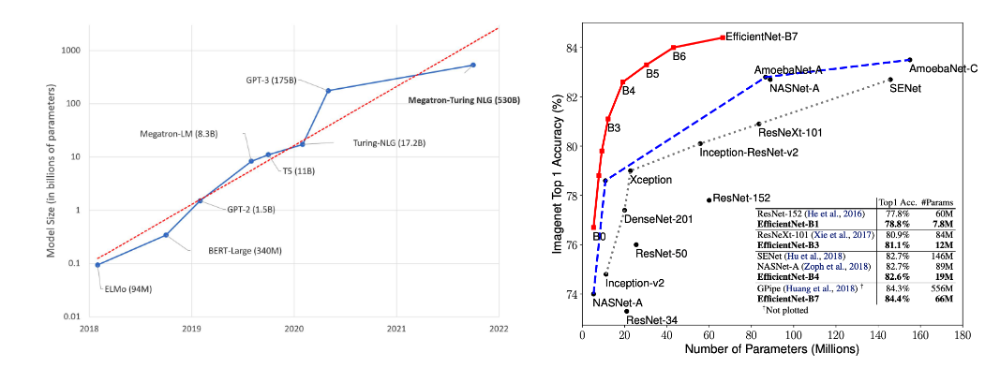
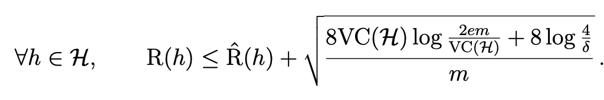
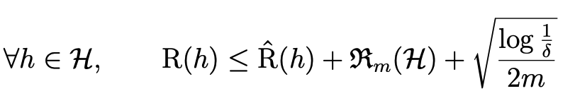
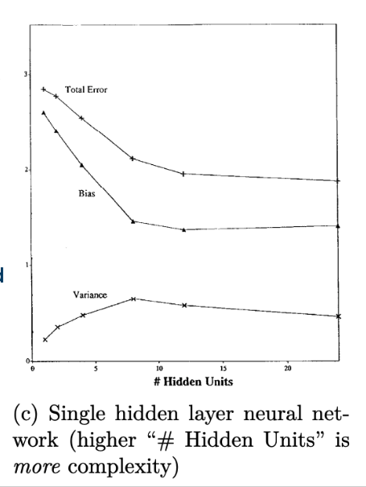
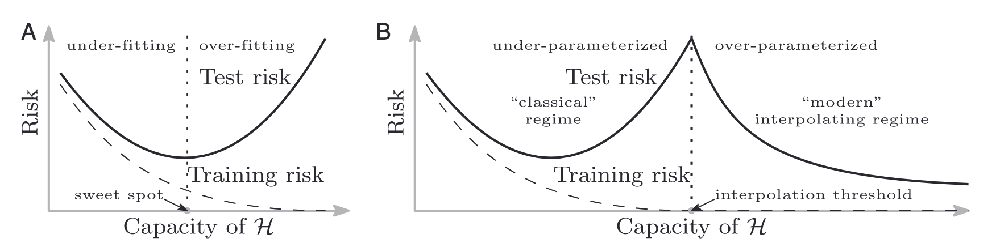
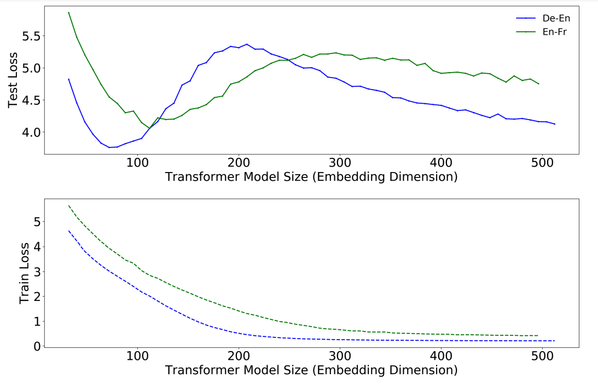
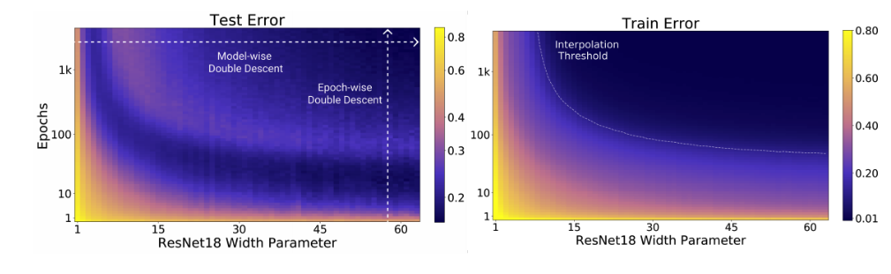
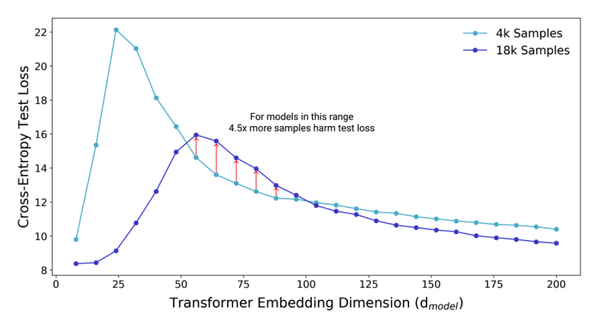

### Background
A while ago I was tasked with developing a model predicting whether patients would be referred to the emergency room, 
based on their medical presentation, demographics, etc. 
The random forest was performing much better on the train set than on the test set.
Technically, it's a case of overfitting, but there was a disagreement among my peers if this was a bad thing or not.
After all, it was better than models that did not exhibit a train-test gap (e.g. logistic regression). 
But still I was not able to convince that test performance is all that should matter. 
So I had a little literature review, and presented it in our weekly journal club. 
This post is a summary of that presentation.  

---
### Intro

Every intro to ML course or textbook teaches us the bias variance tradeoff as universal truth - 
that test error curve follows a U-shape with respect to model complexity.

> “This is a fundamental property of statistical learning that holds regardless of the particular data set at hand and regardless of the statistical method being used.”

Quote and figure from [ISLRv2, 2021](https://hastie.su.domains/ISLR2/ISLRv2_website.pdf)

Yet everywhere around us we see evidence that “bigger models are always better”
[1](https://microsoft.com/en-us/research/blog/using-deepspeed-and-megatron-to-train-megatron-turing-nlg-530b-the-worlds-largest-and-most-powerful-generative-language-model/), 
[2](http://proceedings.mlr.press/v97/tan19a/tan19a.pdf)

How do we relieve this tension? Is it just the difference between traditional machine learning and deep learning? 
Is the tradeoff real at all? Let’s take a stab at settling this.

---
### The Defense  

On the one hand, there is empirical grounding for the tradeoff - it can be shown to exist in models like KNN, polynomial regression, kernel regression, decision trees and more. 

There is some theoretical justification for it too. Generalization bounds that grow with complexity (VC/Rademacher) are interpreted as if simple models are preferable.

> “In real applications, learning models with lower VC(H) tend to generalize better”, Learning From Data, 2021

As an ML history fun fact, the tradeoff was not popularized until the 1992 paper 
“Neural Networks and the Bias/Variance Dilemma” by Geman et. al. 
This same paper also introduced the **decomposition** of the MSE to bias and variance components. 
As the decomposition is usually discussed in the same context, it adds to the strong intuition of the tradeoff (even though it does not imply it). 

---
### The Cracks  

The empirical and theoretical arguments seem fair, but let's see if they stand up to some scrutiny. 

As far back as 95’ there have been works showing that variance remains low for models with increasing complexity. 
Curiously, inconsistencies between classical and neural models are demonstrated even in the 92' paper that popularized the tradeoff:

but the authors dismiss them as related to the training procedure and not a fundamental property of the model class. 

As for the generalization bounds, they are too loose to accurately reflect the test error’s trend in practice.

While these were not sufficient to change the community’s opinion on the tradeoff, it seems that the tide has started to shift in the last 4 years. 
In 2019 [Mikhail Belkin and colleagues](https://www.pnas.org/doi/10.1073/pnas.1903070116) coined *double descent* to describe a fairly prevalent phenomenon where the 
standard bias-variance picture breaks down once zero training error is attained - what they call the 
*interpolation threshold*. Before the interpolation threshold, the tradeoff holds and increasing model 
complexity leads to overfitting. After the interpolation threshold, however, they found that test error actually starts to go down as you keep increasing model complexity. 
This is shown for fully connected networks, random forest and a random fourier feature model.

Concurrent work by [Nakkiran et al.](https://mltheory.org/deep.pdf) has proved that double descent w.r.t *model width* is a robust phenomenon that occurs in a variety of tasks, architectures (CNNs, ResNets, Transformers), and optimization methods.

But more interesting is the phenomenon of training time double descent - training for more epochs decreases performance (before improving again),

And dataset size double descent - using more training samples (x4.5 more in their experiments) decreases performance before improving again.

In some experiments, a single descent (rather than double descent) was observed. But a U-shaped loss curve was never observed for neural nets! Which aligns with the modern practice of “bigger is better”.

---
### Reconciling theory and practice  

There are some suggestive explanations for this deflection between theory and practice. 
Many revolve around the notion of complexity - that we just don’t have a proper measure of it. 
One for which larger models could actually be simpler.
Regardless of whether you accept one of the hypotheses, you can’t argue with the science. 
After all, theory is subordinate to science, as this 
[great talk](https://twitter.com/tomgoldsteincs/status/1484609273162309634?lang=en) 
by Tom Goldstein calls for.

[Brady Neal’s work](https://arxiv.org/abs/1912.08286) on this very subject is subtitled “Textbooks need an update”. 
And indeed recent books include double descent in their discussion of the bias variance tradeoff.
Examples include [ISLRv2](https://hastie.su.domains/ISLR2/ISLRv2_website.pdf), 
[LTFP](https://di.ens.fr/~fbach/ltfp_book.pdf) 
and [ML Story](https://mlstory.org/pdf/patterns.pdf).

Still, more effort should be put in teaching that the bias variance tradeoff is not a universal truth, at least based on the measures of complexity we use in our everyday practice. This has implications on how we select and evaluate ML models.

As a personal note, what’s still missing for me is a rule of thumb for determining if some case of overfitting 
(train error << test error) is benign, or should it suggest that a different model should be selected.

---
