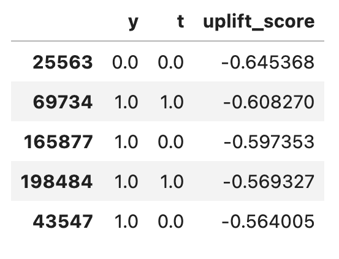

- Which patients are most likely to attend a colon cancer screening after receiving an invitation?

- Which customers would be most likely to stay with their internet provider if they got a persuasive call?

- Which past charity donors are most likely to make another contribution if approached with a compelling request?

These examples sound like prediction problems, but they're not: they ask about the effect of an intervention. Why does it matter? Grab a seat!

In traditional prediction models, the goal is to estimate the likelihood of a particular outcome, such as whether a patient will attend a screening or a customer will remain loyal. However, these models do not reliably estimate the potential impact of specific actions or interventions. This is where uplift modeling comes into play.

#### What is Uplift Modeling?
Uplift modeling, also known as incremental modeling or true lift modeling, focuses on predicting the *incremental* (more on this later) impact of an intervention. Instead of simply forecasting an outcome, uplift models estimate the difference in outcomes between those who receive the intervention and those who do not. This sounds better than pure prediction models..so why isn't everyone using it? Uplift modelling, being a flavor of causal machine learning, is more complex than simple prediction. It comes with a high entry barrier: we need detailed knowledge about how the data was generated. These requirements are known as the assumptions of causal inference, which will detailed next.

#### Requirements for causal inference
Stable Unit Treatment Value Assumption (SUTVA): The effect of intervention on one individual should not influence the effect on another individual. For example, if a participant in a marketing study shares their positive experience with a targeted product with another participant, and this influences the second participant’s decision to try the product, then SUTVA is violated.

Exchangeability: All factors that influence both the treatment assignment and the outcome should be observed and accounted for in the model. To demonstrate, consider the following scenario in a hospital: We observe that every patient who receives a certain medication ends up dying. If we assume that the two treatment groups are comparable, we could conclude that the medication is causing these death. But this is likely not the case - maybe there are additional factors, such as the fact that doctors prescribe this medication only to the most critically ill patients, for whom all other treatments have failed. If we account for the severity of the patients' conditions (and all other factors influencing the decision to treat and the outcome), then we can assume that both groups are exchangeable, hence comparable. And if we don't have access to these factors, then exchangeability is violated. This assumption is also called uncondoundedness or ignorability.

Positivity: Every individual in the data should have a chance (a positive probability, hence the name) of receiving each treatment. If only patients above the age of 50 are eligible for a certain drug, then positivity is violated and we can't infer its effect on the young population. This assumption is also called *overlap* or *common support*, in the sense that the whole population has a shared range of characteristics across treatment groups.

There are two more assumptions that are prerequisites for uplift modeling: consistency, which means the treatment effect we observe should match the true treatment effect for each individual, and the absence of hidden variations in the treatment. These assumptions are straightforward and are generally less challenging to address.

#### RCTs satisfy causal requirements
We see that causal modeling in general and uplift modeling specifically demand a high price before we even start working. Among the requirements, the hardest to satisfy in most cases is the exchangeability assumption. It is unverifiable from data alone, meaning we cannot look at the data and inspect if it holds or not. We need external information about how the data was generated. To demonstrate, see the example in [this post](https://tom-beer.github.io/post/proxies_ci/) where two different processes create an identical distribution for $P(X,Y)$. If we know the data was generated from an RCT, where treatment was randomly allocated, then exchangeability holds because no factors influence both treatment assignment and outcome. Without control over the treatment assignment process, we can never know that we have hold of all factors influencing it, and we cannot guarantee exchangeability. 

The modern practice of uplift modelling relies heavily on the availability of randomized data. In fact, data from an RCT is often considered a requirement for uplift modeling. Randomized data also ensures positivity, as the treatment groups have identical feature distributions $P(X∣T=0)=P(X∣T=1)$ (assuming a sufficiently large sample size relative to the feature vector's cardinality). As for SUTVA, randomized data does not guarantee it, and we need subject-matter knowledge to address it. 

As we know from the clinical domain, RCTs are costly and often impractical. Can we perform uplift modelling without randomized data? We'll explore this question in Part III of this series. For now, we'll focus on the industry standard of using randomized data.

##### Practice
After reviewing the requirements, let's practice some uplift modeling. The basic recipe has just two steps:
1. Causal modeling: Train a model that generates estimates of individual-level treatment effects, also called uplift scores in the context of uplift modeling.
2. Evaluation and decision-making: Use the causal model to define a policy for determining whom to treat.

The remainder of this post will focus on the first step, and the next post will handle the evaluation step. 

##### Data
The data we'll be using is the [Retail Hero competition dataset](https://ods.ai/competitions/x5-retailhero-uplift-modeling/data), preprocessed according to [Juan Orduz](https://github.com/juanitorduz/website_projects/blob/master/Python/uplift.ipynb)'s suggestion. The processed version is available to download from [here](https://dagshub.com/tom1beer/uplift).

Some key properties about this dataset:
* It is an RCT - treatment is randomly assigned 
* The treatment is being contacted by the retail company
* The target is the user making a transaction
* The treatment is almost perfectly balanced between intervention and control (50%/50%), though this is not required for valid uplift modelling. 
* The average response rate among the treated individuals is 63.7%, while for the control group, it is 60.4%. Since this is an RCT, we can infer that the average treatment effect, which is also called the total uplift, is around 3.3%:

```python
data_df.groupby(treatment_col)[target_col].mean().diff()[1]
```
This means that if we had intervened upon the entire population, we could have expected an extra 3% in purchases compared to contacting no one at all.

##### Modeling
To develop an intuition for the modeling approach, let's clearly define its objective. In uplift modeling, we aim to identify and separate individuals who would be positively affected by the treatment from those who would not be. More specifically, we can categorize individuals into four types based on their responses to different treatments:

* Would respond positively regardless of whether they receive the treatment.
* Would not respond regardless of the treatment.
* Would respond positively only if they receive the treatment.
* Would respond positively only if they do not receive the treatment.

Each of these types has specific terminology in the uplift modeling domain, and they are usually presented in a contingency table format, such as this one from [Dataiku](https://blog.dataiku.com/motivation-for-causal-inference):


So our goal is to identify the persuadables with high precision. Targeting the sleeping dogs is the worst case because it leads to a loss in whatever we are optimizing (revenue, number of cancer screening tests, etc.). Additionally, targeting the lost causes and the sure things is also unwanted, as the intervention itself usually has a cost (such as placing a phone call). Therefore, a useful model will generate *persuadability* scores, which we can use to target the individuals with the highest scores. 
  
##### T-learner
To achieve this, we can build two models: one for each treatment group. One model will predict the potential outcome if an individual is treated, and the other will predict the potential outcome if not treated. By subtracting the predictions of the two models, we arrive at the persuadability score. This score, also known as the uplift score, helps us determine who is most likely to benefit from the treatment.

$$\widehat{uplift}(x) = \mu _T (x) - \mu _C (x)$$

This modeling choice is called a T-learner, where "T" stands for "two" because it involves two models. It is a flexible and powerful meta-model, allowing the practitioner to choose any base classifier, from a simple logistic regression to a deep learning model. If the individuals' responses were precisely predictable from the data, we would expect the following:
* The persuadables would have uplift scores close to 1
* The lost causes and sure things would have uplift scores close to 0
* The sleeping dogs would have uplift scores close to -1

There are many great open source python packages that implement meta-learners for causal inference and uplift modeling, [causalml](https://causalml.readthedocs.io/en/latest/index.html) and [scikit-uplift](https://www.uplift-modeling.com/en/latest/) are two examples. Here, we'll implement the model from scratch to demonstrate how simple and intuitive it is:

```python
import pandas as pd
from pathlib import Path
from xgboost.sklearn import XGBClassifier
from sklearn.model_selection import train_test_split

src_dir = Path().cwd()
data_dir = src_dir.parent / "data"

data_df = pd.read_csv(data_dir / 'retailhero-uplift' / 'data' / "processed_data.csv")
```

```python
y = data_df.target
t = data_df.treatment_flg
x = data_df.drop(columns=["treatment_flg", "target", "client_id"])

idx_train, idx_val = train_test_split(
    data_df.index,
    test_size=0.3,
    random_state=17,
    stratify=(y.astype(str) + "_" + t.astype(str)),
)

x_train = x.loc[idx_train]
x_val = x.loc[idx_val]

t_train = t.loc[idx_train]
t_val = t.loc[idx_val]

y_train = y.loc[idx_train]
y_val = y.loc[idx_val]
```

```python
model_treatment, model_control = XGBClassifier(), XGBClassifier()

model_treatment.fit(x_train[t_train == 1], y_train[t_train == 1])
model_control.fit(x_train[t_train == 0], y_train[t_train == 0])

uplift_scores = (model_treatment.predict_proba(x_val) - model_control.predict_proba(x_val))[:, 1]

df = pd.DataFrame({"y": y_val, "t": t_val, "uplift_score": uplift_scores.flatten()})
```


```python
df.sort_values("uplift_score").head()
```


##### Other modelling approaches
In this post we have chosen the T-learner as causal model, but there are many other good choices. Two notable example are:
* Transformed outcome model: This method transforms the problem into a single regression task by adjusting the observed outcomes, allowing standard regression techniques to estimate treatment effects directly.
* End to end modeling: Though we haven't talked about evaluation of uplift models yet, we can already guess that the base model's loss function (cross entropy or some other classification loss) might not be best aligned with what we care about in uplift modeling. Some methods try to directly optimize uplift metrics, aiming to align the model's training process more closely with the goal of maximizing uplift. However, these methods are often not used in practice due to their complexity and computational demands.


#### Summary
That's a wrap for part I! Let's summarize what we've covered so far:
* Uplift models are used to create individual-level targeting policies.
* They improve upon prediction models by using tools from causal inference and modeling all potential outcomes.
* Their objective is to identify and target the persuadable individuals within the population.
* Meta-learners are a flexible and simple approach to achieving this.

Next up, we'll dive deep into the befuddled world of uplift evaluation metrics, with a mission to demystify their names and formulas.
