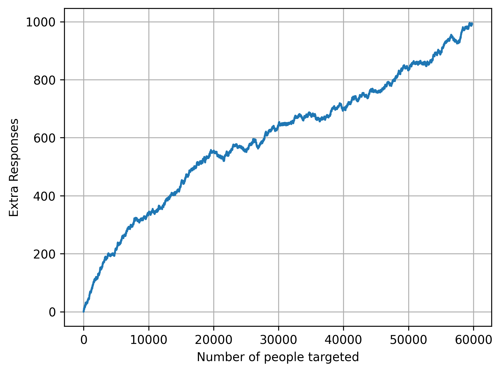
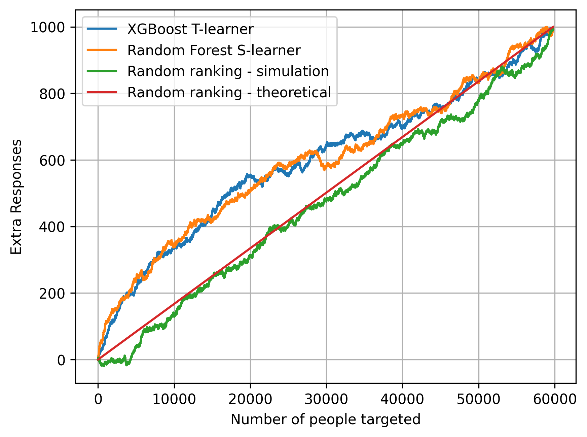

In the [previous post](https://tom-beer.github.io/post/uplift_part1/), we explored how uplift models are crucial for understanding individual-level treatment effects and how the theory and practice of causal machine learning can generate uplift scores. 
This second part of the series will focus on translating those uplift scores into a policy for determining who should be treated, and on evaluating the performance of uplift models.

### Incremental modeling
Uplift modeling is also known as incremental modeling. This terminology stems from the expected output of an uplift model, which is to identify optimal subsets incrementally. An uplift model can be seen as a function that maps subset sizes to instances. For example, if k=1, we expect the model to identify the single individual with the highest propensity for gain. If k=100, we expect the model to identify the top 100 candidates for intervention, and so forth. Hence the notion of incrementality.

Why focus on incremental gains rather than intervening across the entire population? In Part 1, we observed that for the Retail Hero data, intervening on everyone should yield a net benefit (this is not always true for every data generating process, but let's assume it is for this discussion). However, there are two main reasons why we should not target everyone:


1. Sleeping dogs:  
Some individuals may respond negatively to treatment, meaning they generate a positive outcome when not treated but would alter their behavior unfavorably under treatment. A good uplift model will identify these individuals and assign them a low uplift score, allowing us to avoid intervening on them.

2. Cost of intervention: 
Often, interventions carry costs (e.g., time spent on phone calls), and it is more efficient to target only those likely to yield the highest return on investment (ROI). We aim to maximize gain while ensuring costs remain within budget constraints: 
$\max \text{ gain  } \text{s.t. cost}  \leq \text{budget}$.
Many individuals exhibit a net loss, whether they are sure things, lost causes, or sleeping dogs (see the previous post for the customary classification of individual types). This means that if we could predict the potential responses under the two treatment allocations, we could perform much better than a uniform sampling of the population. This is exactly the value proposition of uplift modeling and why an incremental approach is so powerful.

------------

### Ranking
We've seen that uplift scores estimate the treatment effect for individuals. 
For example, if CATE (Conditional Average Treatment Effect) = 0.01, it means that intervening adds 0.01 to the probability of responding. 
However, it's important to understand that perfect calibration of these scores is rare and, in fact, not necessary for practical applications.

What really matters in uplift modeling is not the absolute values of the scores, but rather how the model ranks the population. 
In other words, we're more concerned with whether the model can accurately predict who has a higher treatment effect relative to others, rather than predicting the exact magnitude of those effects.

For this reason, a regular step in uplift modeling is to sort the scores in descending order as soon as they come out of the model. 
This ranking allows us to implement the incremental approach we discussed earlier, targeting individuals with the highest expected uplift first and moving down the list as resources allow.

This ranking approach also aligns well with the practical constraints we often face, such as limited budgets for interventions. 
By focusing on relative rankings rather than absolute scores, we can more easily adjust our targeting strategy to fit within these constraints while still maximizing the overall impact of our interventions.

------------

### The fundamental problem of uplift modeling
As we develop uplift models, we're confronted with a critical question: How can we compare the performance of different models? Or, how can we determine if a candidate model shows any benefit over a naive approach, such as random sampling of the population?

In traditional machine learning, we would typically use evaluation metrics like accuracy or precision. For uplift modeling, we might be tempted to define an accuracy metric that calculates the proportion of persuadables (those we're trying to identify) from the entire subgroup:

$$acc_k = \frac{1}{k} \sum_{i \in \pi(D,k)} [[Y_i(1)=1]] \cdot [[Y_i(0)=0]]$$

<details>
<summary>Details on notation ⬇️</summary>

- $\pi(D,k)$ are the k first instances in dataset $D$ according to the ordering obtained by the uplift model 
- $[[ x ]]$ is the Iverson bracket 
- $Y_i(t)$ is the potential outcome of instance $i$ under treatment $t$  

</details>

However, there's a fundamental problem: we don't have the ground truth data required to calculate these metrics. 
The formula above includes both potential outcomes - the response under treatment $Y_i(1)$ and the response under control $Y_i(0)$. 
But in reality, no individual is both treated and non-treated simultaneously. 
This is known as the fundamental problem of causal inference.

How can we produce reliable evaluations without reliable ground truth data? Remember the assumptions of causal inference from part 1? Have you had a thought along the lines of "why on earth do we need to admit ourselves to stringent, unverifiable assumptions?" Exactly for this - Let's see how:

$$
\mathbb{E}[Y(1)] - \mathbb{E}[Y(0)] = \mathbb{E}[Y(1) \mid T = 1] - \mathbb{E}[Y(0) \mid T = 0] \\
= \mathbb{E}[Y \mid T = 1] - \mathbb{E}[Y \mid T = 0]
$$
(The first equation is due to exchangeability, and the second due to consistency)

This equation shows that under the causal assumptions, we can use observed quantities to represent unmeasurable concepts like potential outcomes. This is the key that unlocks our ability to evaluate uplift models, despite the fundamental problem of causal inference.

------------


### Evaluation from first principles
Our causal assumptions tell us that the treatment and control groups are comparable. 
This means we can calculate metrics on each treatment group separately and then compare them (often by subtracting). 
While we can't compute instance-level metrics, we can aggregate over subgroups.

Let's start by defining some basic quantities:
1. Number of treated and control instances among the top-k:
$$N_\pi^T(D,k) = \sum_{i \in \pi(D,k)}[[t_i=1]]$$
$$N_\pi^C(D,k) = \sum_{i \in \pi(D,k)}[[t_i=0]]$$

2. Number of treated and control responders:
$$R_\pi^T(D,k) = \sum_{i \in \pi(D,k)} [[y_i=1]] \cdot [[t_i=1]]$$
$$R_\pi^C(D,k) = \sum_{i \in \pi(D,k)} [[y_i=1]] \cdot [[t_i=0]]$$

Here, $\pi(D,k)$ represents the top-k instances in dataset $D$ according to the uplift model's ranking.

#### Constructing Uplift Metrics
Using these building blocks, we can define several performance metrics. For simplicity, we'll omit $\pi$ in the following formulas. Here are three common metrics:

$$(1) \quad R^T(D,k)-R^C(D,k)\frac{N^T(D,k)}{N^C(D,k)}$$
$$(2) \quad (\frac{R^T(D,k)}{N^T(D,k)}-\frac{R^C(D,k)}{N^C(D,k)}) \cdot (N^T(D,k)+N^C(D,k))$$
$$(3) \quad \frac{R^T(D,k)}{|T|}-\frac{R^C(D,k)}{|C|}$$

We see many similarities between these metrics. 
They all compute response rates among the treated group and compare (subtract) them to the control group, with various scaling factors related to group sizes.

In the literature, these metrics are known by different names, which can sometimes lead to confusion. 
The first is usually called a _qini_ curve, and the second is commonly referred to as an _uplift_ curve. 
It's customary to plot these metrics as a function of $k$, hence the term "curve" in their names.

#### Joint vs Separate Evaluation
In the metrics above, the top-k ranked instances include both treated and control groups. 
This is known as joint evaluation. 
However, we can also directly compare the highest-scoring treated instances to the highest-scoring controls, which is called separate evaluation.
In this setting, we decide how many treated and how many controls are in the evaluation subgroup.

Separate evaluation allows us to deliberately address imbalances between treatment arms. We can replace $k \in \{1, \ldots, N\}$ with $p \in [0,1]$ and use it to scale the group sizes. 
For example, if $|T|=100$ and $|C|=200$, it makes sense to evaluate the uplift for 10 treatment units and 20 control units, or 30 treatment and 60 control units, and so forth.

For separate evaluation, we define:
$$R_\pi(T,k) = \sum_{i \in \pi(T,k)} [[y_i=1]]$$
$$R_\pi(C,k) = \sum_{i \in \pi(C,k)} [[y_i=1]]$$

Then we can define three more metrics for uplift:
$$(4) \quad R(T,p|T|)-R(C,p|C|)\frac{|T|}{|C|}$$
$$(5) \quad \frac{R(T,p|T|)}{|T|}-\frac{R(C,p|C|)}{|C|}$$
$$(6) \quad R(T,p|T|)-R(C,p|C|)$$

Note that $(4)$ is similar to $(1)$, $(5)$ is similar to $(3)$, and $(6)$ is a bit different in that it does not include any normalization factor.

------------

### Choosing a performance metric
How shall we choose a metric that best helps to compare gains from different models? 
While the uplift modeling literature doesn't always give this topic the attention it deserves, we will try to give motivation or intuition for some of these metrics.  

#### Area Under the Uplift Curve (AUUC)
Before getting into the considerations, it's worth noting that any curve-based metric can be integrated to give a single scalar value. 
This is known as the Area Under the Uplift Curve (AUUC):
$$AUUC = \sum_{k=1}^N V(k)$$
Where $V$ is any curve metric we've discussed.
The AUUC can be useful as a benchmark for comparing models, especially when we don't know the specific fraction of the population we plan to target. However, if we do know our intended operating point (i.e., the fraction of the population we'll intervene on), it's often more informative to evaluate the curve at that specific point.

#### Key Considerations in Metric Selection

1. Joint vs. Separate Evaluation:

Joint evaluation (where top-k includes both treated and control) is generally preferable.
Reasons to prefer joint evaluation:
a) It aligns better with real-world targeting scenarios.
b) It avoids potential violations of the exchangeability assumption.

2. Units of Measurement:

Absolute metrics (e.g., metrics $(1)$, $(4)$, and $(6)$) measure "How many people will respond to the intervention?"
Relative metrics (e.g., metrics $(2)$, $(3)$, and $(5)$) measure "What fraction of the population can we persuade?"
The choice between absolute and relative units often depends on organizational preferences and how value is measured within your context.

#### Recommended Approach
Based on these considerations, here's a suggested approach:

1. Start with joint evaluation metrics unless you have a compelling reason for separate evaluation.
2. If you know your intended targeting depth (e.g., top 10% of the population), evaluate the selected curve at that specific point.
3. If you don't know your targeting depth, consider using the are under the curve as a general performance indicator.
4. Choose between absolute and relative units based on what's most meaningful for your specific use case and stakeholders.
5. Always compare your model's performance to a random targeting baseline to ensure you're achieving meaningful gains.

------------

### Implementation
Now that we've discussed the theory behind uplift evaluation metrics, let's see how to implement them in practice.
#### Preparing the Data
Recall from the end of our last post that we had a DataFrame containing the treatment, outcome, and uplift scores:

#### Calculating Joint Metrics
Let's start by implementing the joint metrics we discussed earlier:

```python
df["nt"] = (df["t"] == 1).cumsum()
df["nc"] = (df["t"] == 0).cumsum()
df["rt"] = ((df["t"] == 1) & (df["y"] == 1)).cumsum()
df["rc"] = ((df["t"] == 0) & (df["y"] == 1)).cumsum()
df["V1"] = df["rt"] - (df["rc"] * df["nt"] / df["nc"])
df["V2"] = ((df["rt"] / df["nt"]) - (df["rc"] / df["nc"])) * (df["nt"] + df["nc"])
df["V3"] = (df["rt"] / (df.t == 1).sum()) - (df["rc"] / (df.t == 0).sum())
```
#### Calculating Separate Metrics
For the separate setting, we need a bit more preparation:

```python
size_control = (df.t == 0).sum()
size_treatment = (df.t == 1).sum()

grid_control = np.round(np.linspace(0, size_control-1, min(size_control, size_treatment)))
grid_treatment = np.round(np.linspace(0, size_treatment-1, min(size_control, size_treatment)))

rc_sep = df.loc[df.t == 0, "rc"].reset_index(drop=True).iloc[grid_control].values
rt_sep = df.loc[df.t == 1, "rt"].reset_index(drop=True).iloc[grid_treatment].values

V4 = rt_sep - rc_sep * (size_treatment / size_control)
V5 = rt_sep / size_treatment - rc_sep / size_control
V6 = rt_sep - rc_sep
```
#### Visualizing the Results
Let's visualize one of these metrics, say $V1$ (often called the 'Qini curve'), as a function of the population size:


Interpreting this plot:
- The x-axis represents the number of individuals targeted, from 0 to the entire population.
- The y-axis shows the V1 metric, which represents the incremental number of positive responses due to the treatment.
- A rising curve indicates that as we target more individuals according to our model's ranking, we continue to see positive uplift.

Cool! But that doesn't help us decide if we should use this model as a targeting policy. 
To put our model's performance in context, let's compare it to a random targeting policy and an alternative model:


Interpreting this comparison:

- Both the XGBoost T-Learner and Random Forest S-Learner outperform the random policy up to about 75% of the population.
- The two models show some differences, but they're relatively small and may not be statistically significant.
- After targeting about 75% of the population, the uplift models' performance converges with the random policy, suggesting diminishing returns for targeting beyond this point.

------------

### Summary
In this post, we've explored aspects of evaluating uplift models and translating their outputs into actionable targeting policies. 
Here are the three key takeaways:

1. **From Scores to strategy**:
We discussed why uplift modeling is called incremental modeling and the importance of ranking. Uplift scores are most valuable for their relative ordering rather than absolute values. This ranking allows us to incrementally target individuals, considering factors like intervention costs and potential negative responses ("sleeping dogs"). The goal is to optimize interventions based on expected impact and available resources.
2. **Overcoming the fundamental problem of causal inference**:
We addressed the challenge of evaluating uplift models when we can't observe both potential outcomes for any individual. 
Using the assumptions of causal inference, we introduced several evaluation metrics for both joint and separate settings. 
These metrics allow us to assess model performance despite the inherent limitations of observational data.
3. **Practical implementation and comparison**:
We demonstrated how to implement, visualize and interpret uplift evaluation metrics. 
We emphasized the need to compare uplift model performance against a random targeting baseline and between different models. 


### Next Up: Uplift Modeling Beyond RCTs
RCTs (Randomized Controlled Trials) are often considered the gold standard for uplift modeling. 
However, they can be costly, require significant organizational effort (such as implementing an experimentation platform), and are sometimes simply infeasible. 
This raises an important question: 
If we don't have access to data from an RCT, does it mean we can't use uplift modeling at all?

In our next post, we'll challenge the commonly held belief that RCTs are an absolute necessity for uplift modeling and explore alternative approaches. Stay tuned!


